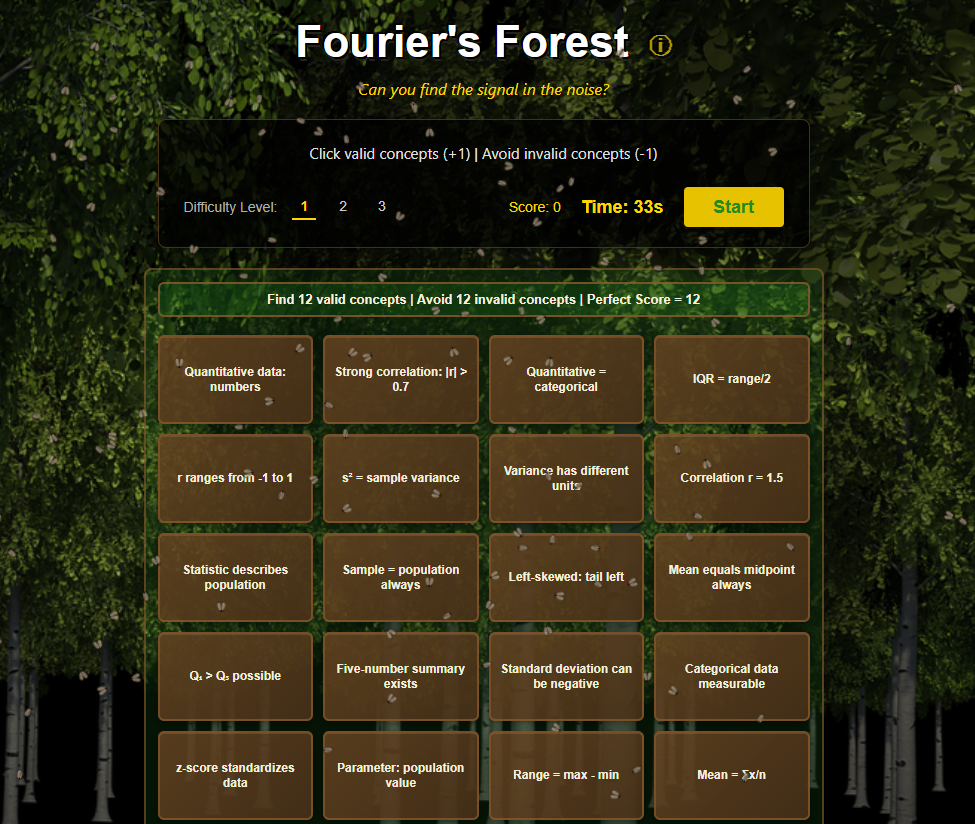

# Fourier’s Forest
**Find the Signal in the Noise**

Fourier’s Forest is an interactive statistics quiz game developed in JavaScript. The project focuses on front-end development and presents questions in a timed, grid-based format. The questions are drawn from AP Statistics concepts and increase in difficulty as the game progresses.

**JavaScript & Front-End Concepts Practiced:**
- DOM manipulation and event handling
- CSS Grid layout for responsive card positioning
- jQuery for dynamic content generation
- Timer functions and game state management
- Modal dialogs and UI interactions

### Gameplay

1. Open `index.html` in your browser
2. Select a difficulty level (Easy, Medium, or Hard)
3. Click "Start" - a grid of statistical concepts appears
4. Click only on valid concepts to score points
5. Avoid invalid concepts (they subtract points)
6. Win by finding more signal than noise before time runs out

### Difficulty Levels

**Level 1 (Easy): Descriptive Statistics**  
Measures of center and spread, data types, basic graphs, and correlation

**Level 2 (Medium): Probability & Inference**  
Probability rules, distributions, sampling distributions, confidence intervals, and hypothesis testing

**Level 3 (Hard): Modeling & Experimental Design**  
Regression, chi-square tests, ANOVA, residual analysis, and experimental design concepts

### Features

- **Three difficulty levels** with varying grid sizes and time limits
- **Scoring system:** +1 for correct, -1 for incorrect
- **Game history saved locally** (last 10 games)
- **Forest-themed visual design** with animated background
- **Info modal** about Joseph Fourier
- **Desktop only gameplay** - mobile not supported
- **Question sets configurable** in `data/questions.js`

### Tech Stack

- HTML5/CSS3 with CSS Grid
- JavaScript and jQuery
- Bug animation library by Auz

### Credits
- Bug animation library by [Auz](https://github.com/Auz/Bug), Forest background from Pixabay, Cicada sound effect from Notification Sounds

### License: MIT License
---
**Author:** K Flowers  
**Contact:** kristirflowers@gmail.com

